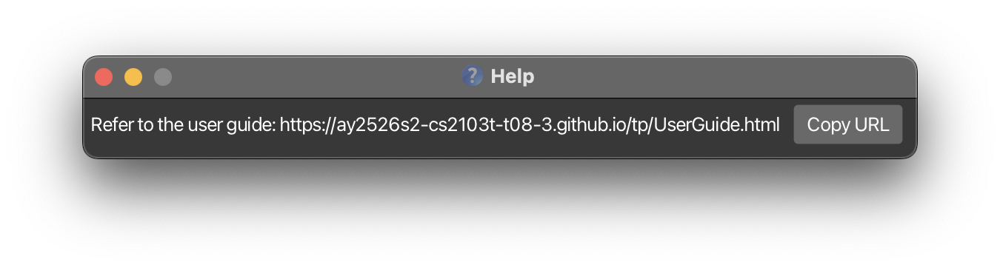
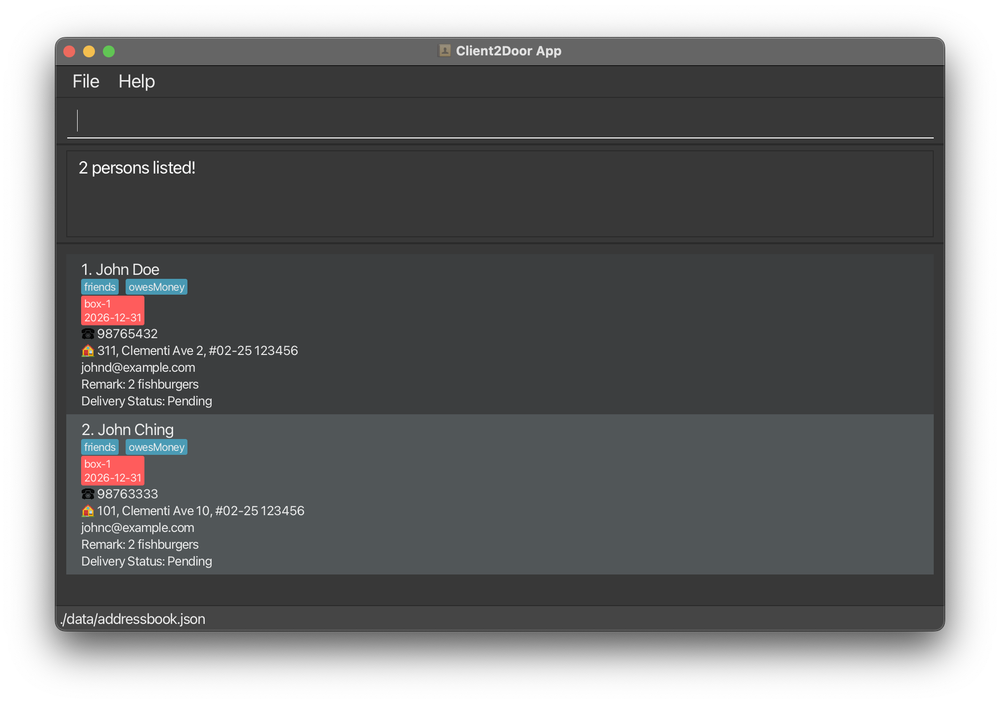
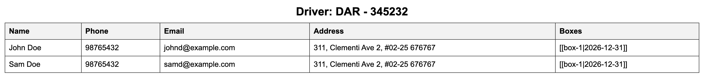
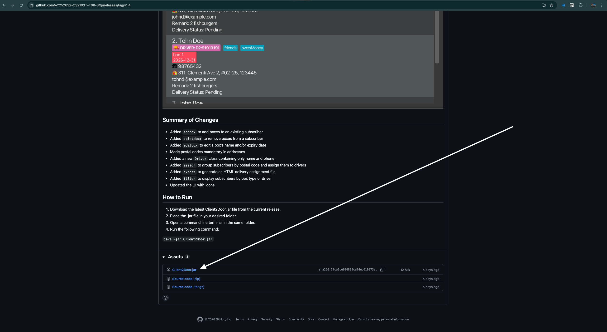
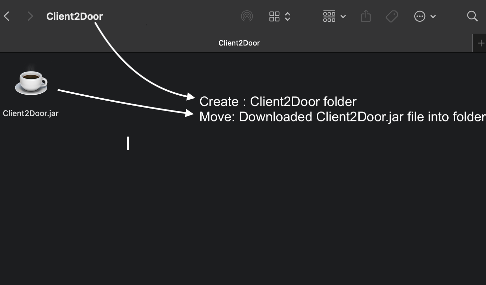
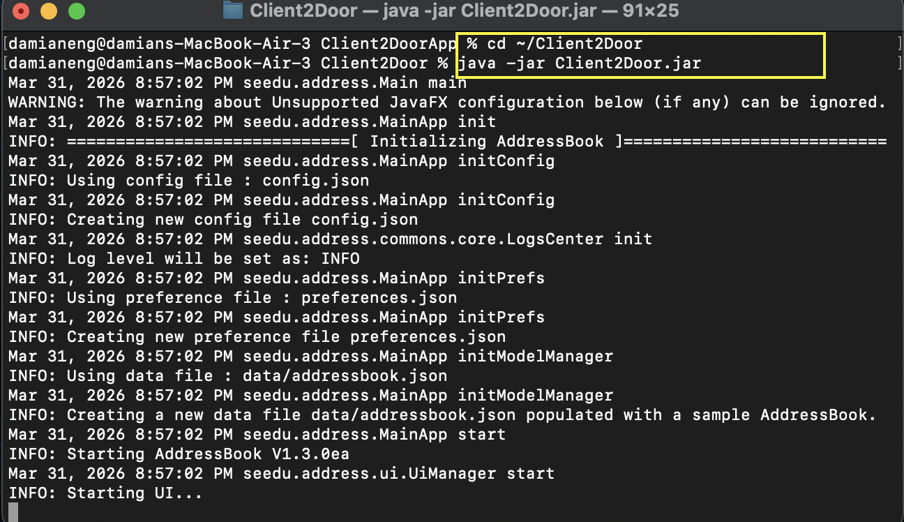

<style>
body { font-family: -apple-system, BlinkMacSystemFont, 'Segoe UI', sans-serif; line-height: 1.6; color: #1f2937; }

/* Headings */
h1 { color: #1e3a8a; border-bottom: 3px solid #2563eb; padding-bottom: 8px; }
h2 { color: #1e40af; border-bottom: 2px solid #3b82f6; padding-bottom: 4px; margin-top: 2em; }
h3 { border-left: 4px solid #3b82f6; padding-left: 10px; color: #1e40af; }
h4 { color: #374151; }

/* Inline code */
code { background-color: #dbeafe; color: #1e3a8a; padding: 2px 6px; border-radius: 4px; font-size: 0.9em; font-weight: 600; }

/* Code blocks */
pre { background-color: #f3f4f6; border: 1px solid #e5e7eb; border-radius: 6px; padding: 12px 16px; }
pre code { background-color: transparent; color: #1f2937; padding: 0; font-weight: normal; }

/* Tables */
table { border-collapse: collapse; width: 100%; margin: 1em 0; }
th { background-color: #eff6ff; color: #1e3a8a; text-align: left; padding: 8px 12px; border: 1px solid #bfdbfe; }
td { padding: 8px 12px; border: 1px solid #e5e7eb; }
tr:nth-child(even) td { background-color: #f8fafc; }

/* Callout boxes — classified by JS below */
blockquote { border-left: 4px solid #cbd5e1; padding: 10px 14px; margin: 12px 0; background-color: #f8fafc; border-radius: 0 4px 4px 0; }
blockquote p { margin: 0; }
blockquote.tip    { background-color: #f0fdf4; border-left-color: #22c55e; }
blockquote.tip    strong:first-child { color: #15803d; }
blockquote.warning{ background-color: #fef2f2; border-left-color: #ef4444; }
blockquote.warning strong:first-child { color: #b91c1c; }
blockquote.note   { background-color: #eff6ff; border-left-color: #3b82f6; }
blockquote.note   strong:first-child { color: #1d4ed8; }
blockquote.caution{ background-color: #fffbeb; border-left-color: #f59e0b; }
blockquote.caution strong:first-child { color: #b45309; }
blockquote.info   { background-color: #f0f9ff; border-left-color: #0ea5e9; }
blockquote.info   strong:first-child { color: #0369a1; }
blockquote.info p { margin: 0.4em 0; }

/* Format line */
p.format-line { background-color: #f5f3ff; border-left: 3px solid #7c3aed; padding: 8px 12px; border-radius: 0 4px 4px 0; }

/* Expected output label */
strong.expected-label { color: #0f766e; }
</style>

# Client2Door User Guide

## Who is this guide for?

Client2Door is built for **small business owners who run recurring delivery or subscription services** — such as meal kit boxes, pastry subscriptions, or monthly packages — and who prefer the speed of a Command Line Interface (CLI) over clicking through menus.

If you find yourself juggling a growing list of subscribers, tracking which boxes need to go out, and coordinating drivers for dispatch, Client2Door is designed to make that faster and less error-prone.

**This guide assumes you:**
- Are comfortable typing commands (no prior CLI experience required — this guide will walk you through it)
- Have basic familiarity with using a computer and file explorer
- Do not need a background in software or programming

## What problem does Client2Door solve?

Managing recurring orders in a spreadsheet gets messy fast — you lose track of who has which box, when subscriptions expire, and who is delivering to whom. Client2Door gives you a single, fast interface to:

- **Manage your subscriber list** — store each subscriber's contact details, delivery address, and remarks (e.g. "leave at door", "allergic to nuts")
- **Track subscription boxes** — assign one or more boxes to each subscriber with expiry dates and delivery statuses
- **Deploy drivers efficiently** — split your subscriber list across drivers with a single command, then export a ready-to-share delivery schedule

---

## Table of Contents

1. [Quick Start](#quick-start)
2. [Key Concepts](#key-concepts)
3. [Features](#features)
   - [Command Format Notes](#notes-about-the-command-format)
   - [Viewing help — `help`](#viewing-help-help)
   - [Adding a subscriber — `add`](#adding-a-subscriber-add)
   - [Adding boxes — `addbox`](#adding-one-or-more-boxes-to-a-subscriber-addbox)
   - [Listing all subscribers — `list`](#listing-all-subscribers-list)
   - [Editing a subscriber — `edit`](#editing-a-subscriber-edit)
   - [Editing a box — `editbox`](#editing-a-box-editbox)
   - [Updating a remark — `remark`](#updating-a-subscribers-remark-remark)
   - [Finding subscribers — `find`](#finding-subscribers-find)
   - [Deleting a subscriber — `delete`](#deleting-a-subscriber-delete)
   - [Deleting boxes — `deletebox`](#deleting-boxes-deletebox)
   - [Marking delivery status — `mark`](#marking-delivery-status-mark)
   - [Filtering subscribers — `filter`](#filtering-subscribers-filter)
   - [Assigning drivers — `assign`](#assigning-drivers-assign)
   - [Exporting assignments — `export`](#exporting-driver-delivery-assignments-export)
   - [Clearing all entries — `clear`](#clearing-all-entries-clear)
   - [Exiting — `exit`](#exiting-the-program-exit)
4. [FAQ](#faq)
5. [Known Issues](#known-issues)
6. [Command Summary](#command-summary)
7. [Appendix: Installing and Running Client2Door](#appendix-installing-and-running-client2door)

---

## Quick start

### Installation

1. Ensure you have Java `17` installed on your computer. Follow the guide for your operating system:
   - **Windows:** [Java 17 Installation Guide for Windows](https://se-education.org/guides/tutorials/javaInstallationWindows.html)
   - **Mac:** [Java 17 Installation Guide for Mac](https://se-education.org/guides/tutorials/javaInstallationMac.html) *(follow this guide exactly — the version matters on Mac)*
   - **Linux:** [Java 17 Installation Guide for Linux](https://se-education.org/guides/tutorials/javaInstallationLinux.html)

2. Download the latest `Client2Door.jar` file from [here](https://github.com/AY2526S2-CS2103T-T08-3/tp/releases).

3. Create a folder anywhere on your computer (e.g. `C:\MyBusiness\Client2Door` on Windows, or `~/Client2Door` on Mac) and move the `.jar` file into it. This folder will store all your data.

4. Open a terminal:
   - **Windows:** Press `Win + R`, type `cmd`, press Enter
   - **Mac:** Open Spotlight (`Cmd + Space`), type `Terminal`, press Enter

5. Navigate to your folder using `cd`. For example:
   ```
   cd C:\MyBusiness\Client2Door
   ```

6. Run the app:
   ```
   java -jar Client2Door.jar
   ```
   The app window should appear within a few seconds, preloaded with sample data.

### Understanding the interface


The app window has three main areas:

| Area | Location | Purpose |
|------|----------|---------|
| **Command Box** | Top | Where you type commands and press Enter to run them |
| **Output Display** | Middle | Shows feedback from your last command: success confirmations or error messages |
| **Result Panel** | Bottom (scrollable) | Displays the results of your command: your subscriber list, search results, or filtered views |


### Your first CLI tutorial

If you have never used a CLI before, follow these steps to get familiar with Client2Door before managing your real data.

**Step 1 — Add a subscriber**

Type the following into the command box at the top and press Enter:
```
add n/Tom Baker p/91234567 e/tombaker@email.com a/123 Orchard Rd Singapore 238888 b/box-1:2
```
The middle output panel will confirm the subscriber was added. Tom Baker will appear at the **bottom** of the result panel with a `Pending` delivery status and one box.

**Step 2 — View your full subscriber list**

```
list
```
The result panel shows all subscribers. Each subscriber has an index number on the left — the subscriber at the top is always index 1, the next is 2, and so on down the list. Since Tom was just added, he will appear at the bottom with the highest index number.

> **Note:** Index numbers are positional and update with every command refresh — they reflect the current position in the result panel, not a fixed ID.

**Step 3 — Find a subscriber**

```
find Bernice
```
The result panel filters to show only subscribers whose names contain "Bernice". The output panel confirms how many results were found. Run `list` to return to the full view.

**Step 4 — Mark a delivery**

Run `list` to see all subscribers and note Tom Baker's index number at the bottom. Then mark his delivery using that index — for example, if Tom is index 9:
```
mark 9 delivered
```
Tom's status updates to `Delivered` in the result panel. The output panel confirms the change.

**Step 5 — Delete the test entry**

Run `list` to see all subscribers and note Tom Baker's index number at the bottom. Then delete him using that index — for example, if Tom is index 9:
```
delete 9
```
Tom Baker is removed. The output panel confirms the deletion. You are now ready to manage your real subscribers.

---

## Key Concepts

Before using Client2Door, it helps to understand three core ideas:

**Subscriber**
A subscriber is a customer who receives regular deliveries from your business. Each subscriber has: 
1. A Name
2. Phone number 
3. Email
4. Delivery address
5. An optional remark (e.g. delivery preferences or notes).

**Box**
A box represents a single recurring delivery package assigned to a subscriber. Each subscriber must have at least one box. Boxes have a name in the format `[type]-[number]` where the type uses underscores for multi-word names (e.g. `box-1`, `pastry-2`, `meal_kit-1`) and an expiry date — after which the subscription is considered lapsed. A subscriber can hold multiple boxes if they have ordered more than one package.

**Delivery Status**
Every subscriber has a delivery status that reflects where their order is in the fulfilment process:
- `Pending` — order received, not yet packed
- `Packed` — box is packed and ready for dispatch
- `Delivered` — box has been delivered to the subscriber

---

## Features

### Notes about the command format:
>
> * Words in `UPPER_CASE` are the parameters to be supplied by you.<br>
>   e.g. in `add n/NAME`, `NAME` is a parameter which can be used as `add n/John Doe`.
>
> * Items in square brackets are optional.<br>
>   e.g. `n/NAME [t/TAG]` can be used as `n/John Doe t/friend` or as `n/John Doe`.
>
> * Items with `…` after them can be used multiple times including zero times.<br>
>   e.g. `[t/TAG]…` can be used as ` ` (i.e. 0 times), `t/friend`, `t/friend t/family` etc.
>
> * Parameters can be in any order.<br>
>   e.g. if the command specifies `n/NAME p/PHONE`, `p/PHONE n/NAME` is also acceptable.
>
> * Extraneous parameters for commands that do not take in parameters (such as `help`, `list`, `exit` and `clear`) will be ignored.<br>
>   e.g. if the command specifies `help 123`, it will be interpreted as `help`.
>
> * If you are using a PDF version of this document, be careful when copying and pasting commands that span multiple lines as space characters surrounding line-breaks may be omitted when copied over to the application.

---

### Viewing help : `help`

Shows a link to this user guide.

Format: `help`

**Expected output:** A help window appears with a link to the online user guide.



---

### Adding a subscriber : `add`

Adds a new subscriber to Client2Door.

Format: `add n/NAME p/PHONE e/EMAIL a/ADDRESS b/BOX_NAME:MONTHS_SUBSCRIBED [r/REMARK] [t/TAG]…`

**Parameter reference:**

| Prefix | Parameter                          | Description                                                                                 |
|--------|------------------------------------|---------------------------------------------------------------------------------------------|
| `n/`   | `NAME`                             | Full name of the subscriber                                                                 |
| `p/`   | `PHONE`                            | Contact number                                                                              |
| `e/`   | `EMAIL`                            | Email address                                                                               |
| `a/`   | `ADDRESS`                          | Delivery address                                                                            |
| `b/`   | `BOX_NAME`<br/>`MONTHS_SUBSCRIBED` | Box name and number of months until subscription ends; At least 1 box subscription required |
| `r/`   | `REMARK`                           | Optional delivery note — defaults to `No remark` if omitted                                 |
| `t/`   | `TAG`                              | Optional tag(s) — can be repeated                                                           |

> **Tip:** Add multiple boxes in one command by repeating `b/`. You can always add more boxes later with [`addbox`](#adding-one-or-more-boxes-to-a-subscriber-addbox).

> **Note:** The subscriber's delivery status is automatically set to `Pending` when first added.

Examples:
* `add n/Sarah Tan p/91234567 e/sarah@email.com a/Blk 10 Ang Mo Kio Ave 4 #05-03 Singapore 560010 b/box-1:2`
* `add n/Wei Ming p/87654321 e/weiming@email.com a/12 Toa Payoh Lor 6 Singapore 310012 b/box-1:2 b/box-2:3 r/Leave at door and ring bell t/VIP`

**Expected output:** The subscriber appears in the result panel at the bottom, and the output panel confirms:


---

### Listing all subscribers : `list`

Shows all subscribers currently in Client2Door.

Format: `list`

> **Tip:** Run `list` after using [`find`](#finding-subscribers-find) or [`filter`](#filtering-subscribers-filter) to return to the full subscriber view.

**Expected output:** All subscribers appear in the result panel. The output panel shows: `Listed all persons`.

---

### Editing a subscriber : `edit`

Edits the details of an existing subscriber.

Format: `edit INDEX [n/NAME] [p/PHONE] [e/EMAIL] [a/ADDRESS] [r/REMARK] [t/TAG]…`

* The `INDEX` refers to the number shown next to the subscriber's name in the current list. It **must be a positive integer** (1, 2, 3, …).
* At least one field must be provided.
* When editing tags, all existing tags are replaced — editing tags is not cumulative.
* To remove all tags, type `t/` with nothing after it.
* To clear remark, type `r/` with nothing after it.
* To update just the remark, you can also use the dedicated [`remark`](#updating-a-subscribers-remark-remark) command.
* See also: [`editbox`](#editing-a-box-editbox) to change box names or expiry dates.

Examples:
* `edit 1 p/98887777 e/sarah_new@email.com` — updates the phone and email of subscriber 1.
* `edit 2 a/50 Jurong West Ave 1 Singapore 649520 r/prefers afternoon delivery t/` — updates address and remark for subscriber 2 and removes all tags.

**Expected output:** The output panel confirms the edit and shows the subscriber's updated details.


---

### Updating a subscriber's remark : `remark`

Updates the delivery remark for a subscriber.

Format: `remark INDEX REMARK`

* The `INDEX` refers to the number shown next to the subscriber in the current list. It **must be a positive integer** (1, 2, 3, …).
* You can also update remarks via [`edit`](#editing-a-subscriber-edit) using the `r/` prefix.

> **Tip:** Use remarks for delivery-specific notes like "ring doorbell", "leave at guardhouse", or "call before arriving".

Examples:
* `remark 1 leave at door and no need to ring bell`
* `remark 2 allergic to nuts`

**Expected output:** The output panel confirms the remark has been updated.


---

### Finding subscribers : `find`

Filters the subscriber list to show only subscribers whose names match the given keywords.

Format: `find KEYWORD [MORE_KEYWORDS]…`

* Search is case-insensitive: `sarah` matches `Sarah`.
* Keyword order does not matter: `Tan Sarah` matches `Sarah Tan`.
* Only full words are matched: `Sar` will not match `Sarah`.
* Returns all subscribers matching **at least one** keyword (OR search).

> **Tip:** Use `find` before `delete` or `edit` to locate the right subscriber and confirm their index number before making changes.

Examples:
* `find Sarah` — returns all subscribers named Sarah.
* `find Sarah Wei` — returns subscribers named Sarah or Wei.

**Expected output:** The list filters to matching subscribers. The output panel shows how many were found.



Run [`list`](#listing-all-subscribers-list) to return to the full subscriber view.

---

### Deleting a subscriber : `delete`

Permanently removes a subscriber from Client2Door.

Format: `delete INDEX`

* The `INDEX` refers to the number shown next to the subscriber's name in the current list. It **must be a positive integer** (1, 2, 3, …).

> **Warning:** Deletion is permanent and cannot be undone. Use [`find`](#finding-subscribers-find) to confirm you have the right subscriber before deleting. Consider running [`export`](#exporting-driver-delivery-assignments-export) before bulk deletions to save a copy of your data.

Examples:
* `list` then `delete 2` — deletes the 2nd subscriber in the full list.
* `find Sarah` then `delete 1` — deletes the first result from the search.

**Expected output:** The subscriber is removed from the list. The output panel confirms the deletion.


---

### Marking delivery status : `mark`

Updates the delivery status of a subscriber.

Format: `mark INDEX STATUS`

* The `INDEX` refers to the number shown next to the subscriber in the current list. It **must be a positive integer** (1, 2, 3, …).
* `STATUS` must be one of: `PENDING`, `PACKED`, or `DELIVERED` (not case-sensitive).

> **Tip:** Use `mark` as you progress through your fulfilment workflow — mark as `packed` once boxes are ready, then `delivered` after drop-off. This keeps your list up to date for driver coordination.

Examples:
* `mark 1 packed` — marks subscriber 1 as Packed.
* `mark 2 delivered` — marks subscriber 2 as Delivered.
* `mark 3 pending` — resets subscriber 3 back to Pending.

**Expected output:** The subscriber's status updates in the list. The output panel confirms the change.


---

### Filtering subscribers : `filter`

Narrows the result panel to show only subscribers matching a box type or an assigned driver.

Format: `filter BOX_NAME [MORE_BOX_NAMES]…` OR `filter d/DRIVER_NAME [d/MORE_DRIVER_NAMES]…`

* At least one of `BOX_NAME` or `d/DRIVER_NAME` must be provided.
* `BOX_NAME` filters by the box type subscribers have (e.g. `box-1`).
* `d/DRIVER_NAME` filters by the driver assigned to subscribers.
* Subscribers matching **at least one** of the provided filters will be shown.
* Run [`list`](#listing-all-subscribers-list) to return to the full subscriber view.

> **Tip:** Use `filter d/DRIVER_NAME` after running [`assign`](#assigning-drivers-assign) to review exactly which subscribers each driver is responsible for before exporting.

Examples:
* `filter box-1` — shows all subscribers who have a `box-1` box.
* `filter d/David Lim` — shows all subscribers assigned to driver David Lim.

**Expected output — filtering by box type:**

Before filtering, all subscribers are shown:


After running `filter box-1`, only matching subscribers remain:


**Expected output — filtering by driver:**

Before filtering by driver:


After running `filter d/David Lim`, only that driver's subscribers are shown:


---

### Adding one or more boxes to a subscriber : `addbox`

Adds one or more boxes to an existing subscriber.

Format: `addbox n/NAME b/BOX_NAME:MONTHS_SUBSCRIBED [b/MORE_BOX_NAME:MONTHS_SUBSCRIBED]…`

* The subscriber is identified by their exact `NAME`.
* See also: [`add`](#adding-a-subscriber-add) to add boxes when first creating a subscriber.

> **Tip:** Use this command when a subscriber renews or upgrades their order mid-cycle without changing their other details.

Examples:

Suppose the current date is `8 April 2026`,
* `addbox n/Sarah Tan b/box-3:4` — adds one new box to Sarah Tan, expiring 4 months later, hence with an expiry date of 2026-08-31.
* `addbox n/Wei Ming b/box-3:5 b/box-4:5` — adds two boxes to Wei Ming, both expiring 5 months later at 2026-09-30.

**Expected output:** The output panel confirms the boxes have been added and shows the subscriber's updated details.

---

### Editing a box : `editbox`

Edits the name or expiry date of an existing box belonging to a subscriber.

Format: `editbox n/NAME b/OLD_BOX_NAME [nb/NEW_BOX_NAME] [ex/MONTHS_SUBSCRIBED]`

* The subscriber is identified by their exact full `NAME`.
* `b/OLD_BOX_NAME` identifies which box to edit.
* At least one of `nb/` or `ex/` must be provided.
* See also: [`addbox`](#adding-one-or-more-boxes-to-a-subscriber-addbox) to add new boxes, [`deletebox`](#deleting-boxes-deletebox) to remove boxes.

Examples:
* `editbox n/Sarah Tan b/box-1 nb/box-2` — renames the box.
* `editbox n/Sarah Tan b/box-2 ex/3` — sets the expiry date to 3 months after the present date.
* `editbox n/Wei Ming b/box-1 nb/box-3 ex/4` — renames box AND updates expiry to 4 months after the present date.
> **Note:** Present date here refers to the present date in our time, not the previous expiry date before the edit.

**Expected output:** The output panel confirms the update and shows the box's new details.


---

### Deleting boxes : `deletebox`

Removes one or more boxes from a subscriber.

Format: `deletebox n/NAME b/BOX_NAME [b/BOX_NAME]…`

* The subscriber is identified by their exact `NAME`.
* At least one box must be specified.
* See also: [`addbox`](#adding-one-or-more-boxes-to-a-subscriber-addbox) to add boxes.

> **Warning:** If you delete all boxes belonging to a subscriber, the subscriber will also be permanently deleted from Client2Door.

Examples:
* `deletebox n/Sarah Tan b/box-1` — removes one box from Sarah Tan.
* `deletebox n/Wei Ming b/box-1 b/box-2` — removes two boxes. If these are Wei Ming's only boxes, Wei Ming will also be deleted.

**Expected output:** The output panel confirms which boxes were removed.


---

### Assigning drivers : `assign`

Splits **all subscribers** in Client2Door into groups and assigns a driver to each group, regardless of what is currently shown in the result panel.

Format: `assign n/NAME p/PHONE [n/NAME p/PHONE]…`

* Assigns drivers to **all subscribers** in Client2Door — the current view does not affect who gets assigned.
* The number of `n/… p/…` pairs determines how many groups are created. Subscribers are divided roughly equally.
* All driver phone numbers must be unique within the command.
* Any existing driver assignment on a subscriber is replaced.
* See also: [`export`](#exporting-driver-delivery-assignments-export) to generate a shareable delivery schedule after assigning.

> **Tip:** Run `assign` at the start of each delivery cycle to redistribute all subscribers across your available drivers for that day.

Examples:
* `assign n/David Lim p/91234567` — assigns all subscribers to David Lim.
* `assign n/David Lim p/91234567 n/Priya Nair p/98765432` — splits all subscribers between two drivers.
* `assign n/David Lim p/91234567 n/Priya Nair p/98765432 n/Ali Hassan p/81234567` — splits all subscribers across three drivers.

**Expected output:** Every subscriber in Client2Door is tagged with their assigned driver. The output panel confirms how many subscribers were assigned and to which drivers.

---

### Exporting driver delivery assignments : `export`

Generates a shareable HTML file listing all drivers and their assigned subscribers.

Format: `export [FILE_PATH]`



* If `FILE_PATH` is omitted, the file is saved to `data/delivery_assignments.html` in your Client2Door folder.
* If a file already exists at the specified path, it will be overwritten.
* `FILE_PATH` must end with `.html`.
* Requires at least one driver to have been assigned via [`assign`](#assigning-drivers-assign) first.

> **Tip:** Open the exported `.html` file in any web browser to view a clean, printable summary. You can share it with your drivers directly.

> **Warning:** If no driver assignments exist, the export will fail with an error message. Run [`assign`](#assigning-drivers-assign) first.

Examples:
* `export` — saves to `data/delivery_assignments.html`.
* `export data/march-delivery.html` — saves to a named file for a specific run.

**Expected output:** The output panel confirms the file has been saved and shows the file path.

---

### Importing subscribers : `import`

Imports subscribers from a CSV file in the `data/` folder into Client2Door.

Format: `import FILE_NAME.csv`

* `FILE_NAME.csv` must be the name of a CSV file located in the `data/` folder of your Client2Door folder.
* Provide only the file name, not a path. For example, use `import april-subscribers.csv`, not `import data/april-subscribers.csv`.
* The file name must end with `.csv`.
* The first row of the CSV file is treated as a header and is skipped automatically.
* Valid rows are imported as new subscribers and added to your existing data.
* Invalid or duplicate rows are skipped and reported in the output panel.
* Imported subscribers start with delivery status `Pending`.
* Tags are not imported from the CSV file.

> **Tip:** Place the CSV file in the `data/` folder before running `import`. This command reads only from that folder.

> **Warning:** The `import` command only accepts CSV files. Files generated by [`export`](#exporting-driver-delivery-assignments--export) are HTML summaries and cannot be imported back into Client2Door.

Examples:
* `import april-subscribers.csv` — imports subscribers from `data/april-subscribers.csv`.
* `import backup_2026_04.csv` — imports another CSV file stored in the same folder.

**Expected output:** The output panel shows how many subscribers were imported successfully. If any rows are skipped, the output also lists the failed rows and the reason.

---

### Clearing all entries : `clear`

Removes all subscribers from Client2Door.

Format: `clear`

> **Warning:** This permanently deletes all subscriber data and cannot be undone. Run [`export`](#exporting-driver-delivery-assignments-export) before clearing if you may need the data again.

**Expected output:** The subscriber list becomes empty. The output panel shows: `Address book has been cleared!`

---

### Exiting the program : `exit`

Closes Client2Door.

Format: `exit`

**Expected output:** The application window closes. All data has already been saved automatically.

---

### Saving the data

Client2Door saves all data automatically to the hard disk after every command that changes data. There is no need to save manually.

---

## FAQ

**Q: How do I transfer my data to another computer?**<br>
A: Use the [`export`](#exporting-driver-delivery-assignments-export) command to save your data, then transfer the exported file to the other computer and use the `import` command to load it.

**Q: What happens if I accidentally run `clear`?**<br>
A: All data is permanently deleted and cannot be recovered from within the app. Use [`export`](#exporting-driver-delivery-assignments-export) regularly to keep a saved copy of your delivery data.

**Q: Can two subscribers share the same box name?**<br>
A: Yes — box names are unique per subscriber, not across all of Client2Door. Two different subscribers can each have a box named `box-1`.

**Q: Why is my `export` failing?**<br>
A: The `export` command requires at least one driver to have been assigned via `assign` first. Run `assign` and then retry `export`.

**Q: What happens to driver assignments if I run `assign` again?**<br>
A: All previous driver assignments for every subscriber are replaced. The `assign` command always acts on all subscribers in Client2Door, regardless of the current view.

---

## Known issues

1. **When using multiple screens**, if you move the application to a secondary screen and later switch back to a single screen, the GUI may open off-screen. To fix this, delete the `preferences.json` file in your Client2Door folder and relaunch the app.
2. **If you minimise the Help Window** and then run `help` again, no new window will appear. Restore the minimised window manually.

---

## Command summary

| Action | Format                                                                                  | Example                                                                     |
|--------|-----------------------------------------------------------------------------------------|-----------------------------------------------------------------------------|
| **Add** | `add n/NAME p/PHONE e/EMAIL a/ADDRESS b/BOX_NAME:MONTHS_SUBSCRIBED [r/REMARK] [t/TAG]…` | `add n/Sarah Tan p/91234567 e/sarah@email.com a/Blk 10 AMK Ave 4 b/box-1:2` |
| **Edit** | `edit INDEX [n/NAME] [p/PHONE] [e/EMAIL] [a/ADDRESS] [r/REMARK] [t/TAG]…`               | `edit 2 p/98887777 r/prefers afternoon delivery`                            |
| **Delete** | `delete INDEX`                                                                          | `delete 3` or `delete sarah@email.com`                                      |
| **Find** | `find KEYWORD [MORE_KEYWORDS]…`                                                         | `find Sarah Wei`                                                            |
| **List** | `list`                                                                                  | `list`                                                                      |
| **Mark** | `mark INDEX STATUS`                                                                     | `mark 1 delivered`                                                          |
| **Filter** | `filter BOX_NAME [MORE_BOX_NAMES]…` or `filter d/DRIVER_NAME [d/MORE_DRIVER_NAMES]…`    | `filter box-1` or `filter d/David Lim`                                      |
| **Remark** | `remark INDEX REMARK`                                                                   | `remark 2 leave at door`                                                    |
| **Add Box** | `addbox n/NAME b/BOX_NAME:MONTHS_SUBSCRIBED [b/BOX_NAME:MONTHS_SUBSCRIBED]…`            | `addbox n/Sarah Tan b/box-3:4`                                              |
| **Edit Box** | `editbox n/NAME b/OLD_BOX_NAME [nb/NEW_BOX_NAME] [ex/MONTHS_SUBSCRIBED]`                | `editbox n/Sarah Tan b/box-1 nb/box-2 ex/3`                                 |
| **Delete Box** | `deletebox n/NAME b/BOX_NAME [b/BOX_NAME]…`                                             | `deletebox n/Sarah Tan b/box-1`                                             |
| **Assign** | `assign n/NAME p/PHONE [n/NAME p/PHONE]…`                                               | `assign n/David Lim p/91234567 n/Priya Nair p/98765432`                     |
| **Export** | `export [FILE_PATH]`                                                                    | `export data/march-delivery.html`                                           |
| **Clear** | `clear`                                                                                 | `clear`                                                                     |
| **Help** | `help`                                                                                  | `help`                                                                      |
| **Exit** | `exit`                                                                                  | `exit`                                                                      |

---

## Appendix: Installing and Running Client2Door

This appendix walks you through installing Java and launching Client2Door for the first time, with step-by-step instructions for Windows, Mac, and Linux.

---

### Step 1: Install Java 17

Client2Door requires Java 17. Follow the guide for your operating system below.

#### Windows

1. Visit the [Java 17 Installation Guide for Windows](https://se-education.org/guides/tutorials/javaInstallationWindows.html).
2. Download the Java 17 installer (`.exe` file).
3. Run the installer and follow the on-screen instructions.
4. To verify the installation, open Command Prompt (`Win + R`, type `cmd`, press Enter) and run:
   ```
   java -version
   ```
   You should see output like: `java version "17.x.x"`.

#### Mac

1. Visit the [Java 17 Installation Guide for Mac](https://se-education.org/guides/tutorials/javaInstallationMac.html).
2. Follow the guide exactly — the specific JDK version prescribed matters on Mac.
3. To verify, open Terminal (`Cmd + Space`, type `Terminal`, press Enter) and run:
   ```
   java -version
   ```
   You should see output like: `java version "17.x.x"`.

#### Linux

1. Visit the [Java 17 Installation Guide for Linux](https://se-education.org/guides/tutorials/javaInstallationLinux.html).
2. Follow the instructions for your Linux distribution.
3. To verify, open a terminal and run:
   ```
   java -version
   ```
   You should see output like: `java version "17.x.x"`.

---

### Step 2: Download Client2Door

1. Go to the [Client2Door releases page](https://github.com/AY2526S2-CS2103T-T08-3/tp/releases).
2. Download the latest `Client2Door.jar` file.



---

### Step 3: Set up your folder

Create a dedicated folder for Client2Door and place the `.jar` file inside it. This folder will also store your subscriber data automatically.

| OS | Example folder path |
|----|-------------------|
| Windows | `C:\MyBusiness\Client2Door\` |
| Mac | `~/Client2Door/` |
| Linux | `~/Client2Door/` |



---

### Step 4: Launch the app

Open a terminal and navigate to your folder using the `cd` command, then run the app.

**Windows (Command Prompt):**
```
cd C:\MyBusiness\Client2Door
java -jar Client2Door.jar
```

**Mac / Linux (Terminal):**
```
cd ~/Client2Door
java -jar Client2Door.jar
```

The Client2Door window will appear within a few seconds, preloaded with sample data so you can explore the interface before adding your own subscribers.



> **Tip:** You can create a simple script or shortcut to run these two commands automatically each time you want to launch the app.

<script>
// Classify blockquotes by their first bold label for color coding
document.querySelectorAll('blockquote').forEach(bq => {
  const firstStrong = bq.querySelector('p > strong:first-child');
  if (!firstStrong) return;
  const label = firstStrong.textContent.trim().replace(/:$/, '').toLowerCase();
  if (label === 'tip') bq.classList.add('tip');
  else if (label === 'warning') bq.classList.add('warning');
  else if (label === 'note') bq.classList.add('note');
  else if (label === 'caution') bq.classList.add('caution');
  else if (label.startsWith('notes')) bq.classList.add('info');
});

// Style Format: paragraphs
document.querySelectorAll('p').forEach(p => {
  if (/^Format:/.test(p.textContent.trim())) {
    p.classList.add('format-line');
  }
});

// Style Expected output labels
document.querySelectorAll('p strong, p b').forEach(el => {
  if (el.textContent.trim().startsWith('Expected output')) {
    el.classList.add('expected-label');
  }
});
</script>
