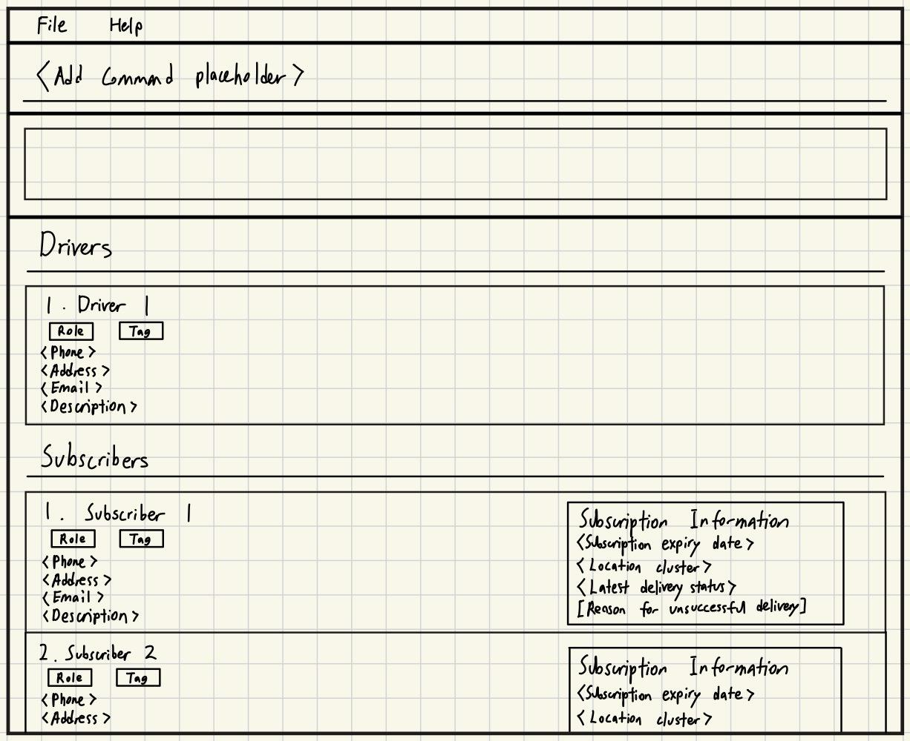

# Client2Door

**Client2Door is a desktop application for managing subscribers, subscriptions, and deliveries.** While it has a GUI, most user interactions happen using a CLI (Command Line Interface).

Built for subscription-box delivery workflows, Client2Door helps users maintain subscriber records, manage box subscriptions, update delivery remarks and statuses, assign drivers for fulfilment, and review subscribers using filtering tools. It also supports CSV import for onboarding subscriber data in bulk and HTML export for generating delivery assignment summaries.

By bringing subscriber, box, and driver management into a single application, Client2Door makes fulfilment operations more organized and efficient.

* If you are interested in using Client2Door, head over to the [_Quick Start_ section of the **User Guide**](UserGuide.html#quick-start).
* If you are interested in developing Client2Door, the [**Developer Guide**](DeveloperGuide.html) is a good place to start.

**Acknowledgements**

* Libraries used: [JavaFX](https://openjfx.io/), [Jackson](https://github.com/FasterXML/jackson), [JUnit5](https://github.com/junit-team/junit5)
